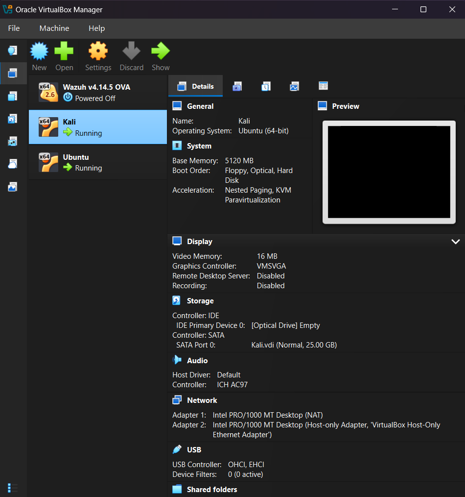
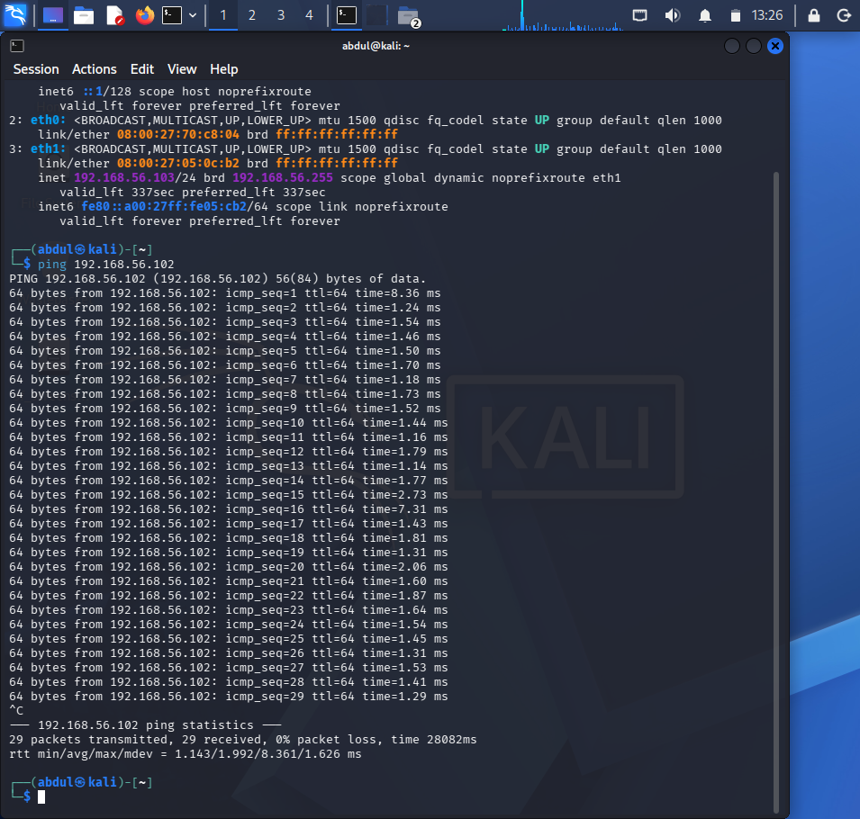
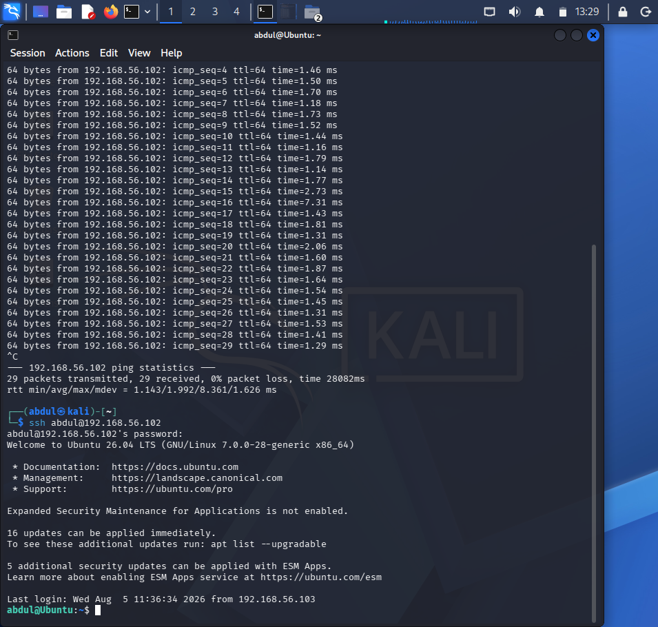

# Lab 01 – Building a Cybersecurity Home Lab

## Objective

Build a secure virtual lab for learning Linux administration, networking, remote access, packet analysis, and cybersecurity tools.

---

## Lab Environment

### Host Machine

| Component | Details |
|----------|---------|
| Operating System | Windows 11 |
| Memory | 16 GB RAM |
| Processor | AMD Processor |

### Virtualization Platform

- Oracle VirtualBox

### Virtual Machines

| Machine | Purpose |
|---------|---------|
| Kali Linux | Attacker / Administration workstation |
| Ubuntu Server 24.04 LTS | Target Linux server |

---

## Network Configuration

The virtual machines were configured using:

- NAT Adapter
- Host-only Adapter

This configuration provided internet connectivity while allowing secure communication between the virtual machines.

---

## Tasks Completed

- Installed Oracle VirtualBox
- Installed Kali Linux
- Installed Ubuntu Server
- Configured virtual networking
- Verified network connectivity
- Connected from Kali to Ubuntu using SSH
- Successfully transferred files using SCP

## Configuring VirtualBox

The virtual environment consists of two virtual machines connected using NAT and Host-only networking.

---

## Verifying Connectivity

Connectivity between Kali Linux and Ubuntu Server was verified using ICMP.

---

## Remote Access

SSH was configured successfully, allowing secure remote administration.

---

## Tools Used

- Oracle VirtualBox
- Kali Linux
- Ubuntu Server
- SSH
- SCP
- Linux Terminal

---

## Skills Demonstrated

- Virtualization
- Linux Administration
- Network Configuration
- Remote Access
- Secure File Transfer
- Basic Troubleshooting

---

## Lessons Learned

Building a home lab provides a safe environment for learning and testing cybersecurity concepts. During this lab, I gained practical experience configuring virtual machines, establishing secure remote connections with SSH, and transferring files using SCP. This environment will serve as the foundation for future networking, security monitoring, and penetration testing labs.