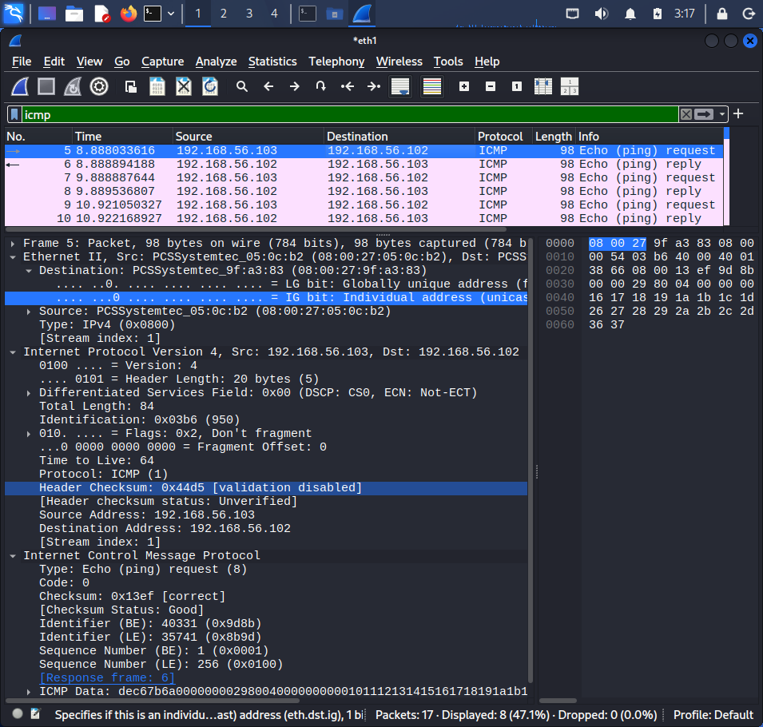
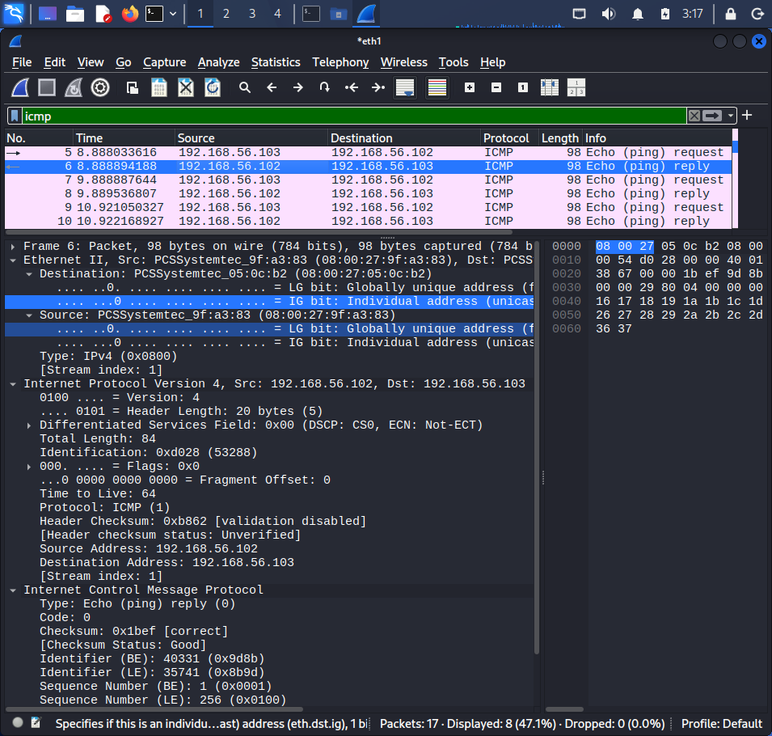

# Lab 05 – Wireshark Packet Analysis

## Objective

Capture and analyse network traffic between Kali Linux and Ubuntu Server using Wireshark.

The exercise focused on examining ICMP traffic generated by a controlled ping and analysing the packet at the Ethernet II, IPv4, and ICMP protocol layers.

---

## Lab Environment

| System | Role | Host-only IP |
|---|---|---|
| Kali Linux | Packet capture workstation | `192.168.56.103` |
| Ubuntu 26.04 LTS | Target system | `192.168.56.102` |

Network:

```text
192.168.56.0/24
```

The traffic was captured on the Kali Linux `eth1` interface.

---

## 1. Identify the Capture Interface

The Kali network interfaces were examined using:

```bash
ip addr
```

The Host-only interface was identified as:

```text
eth1
```

with the address:

```text
192.168.56.103/24
```

The routing table confirmed that traffic for the Host-only network was routed through `eth1`:

```bash
ip route
```

Output:

```text
192.168.56.0/24 dev eth1
```

Wireshark was therefore configured to capture traffic on `eth1`.

---

## 2. Generate Test Traffic

A controlled ICMP exchange was generated from Kali using:

```bash
ping -c 4 192.168.56.102
```

The ping generated ICMP Echo Request and Echo Reply packets between Kali and Ubuntu.

The resulting traffic was captured in Wireshark.

---

## 3. Filter ICMP Traffic

The Wireshark display filter:

```text
icmp
```

was applied to isolate ICMP packets from the capture.

The capture contained ICMP Echo Request and Echo Reply traffic corresponding to the ping operation.

---

## 4. Analyse the ICMP Echo Request

The first Echo Request was examined at the protocol layers.

### Ethernet II

| Field | Value |
|---|---|
| Source MAC | `08:00:27:05:0c:b2` |
| Destination MAC | `08:00:27:9f:a3:83` |
| Type | IPv4 |

The source MAC address corresponds to the Kali `eth1` interface, while the destination MAC address corresponds to the Ubuntu virtual network interface.

### IPv4

| Field | Value |
|---|---|
| Source | `192.168.56.103` |
| Destination | `192.168.56.102` |
| TTL | `64` |
| Protocol | ICMP (`1`) |

The TTL value was 64. Because the two systems communicated directly on the same Host-only subnet, the packet did not need to traverse an IP router between the two virtual machines.

### ICMP

| Field | Value |
|---|---|
| Type | `8` |
| Code | `0` |
| Sequence | `1` |

ICMP Type 8 with Code 0 represents an Echo Request.

---

## 5. Analyse the ICMP Echo Reply

The corresponding Echo Reply was then examined.

### Ethernet II

| Field | Value |
|---|---|
| Source MAC | `08:00:27:9f:a3:83` |
| Destination MAC | `08:00:27:05:0c:b2` |
| Type | IPv4 |

The Ethernet source and destination addresses are reversed relative to the Echo Request.

### IPv4

| Field | Value |
|---|---|
| Source | `192.168.56.102` |
| Destination | `192.168.56.103` |

The IPv4 source and destination addresses are also reversed relative to the request.

### ICMP

| Field | Value |
|---|---|
| Type | `0` |
| Code | `0` |
| Sequence | `1` |

ICMP Type 0 with Code 0 represents an Echo Reply.

---

## 6. Packet Flow

The captured exchange can be represented as:

```text
Kali                                      Ubuntu
192.168.56.103                            192.168.56.102
08:00:27:05:0c:b2                         08:00:27:9f:a3:83
    │                                          │
    │──── ICMP Echo Request ─────────────────►│
    │     Type 8 / Code 0                     │
    │     Sequence 1                          │
    │                                          │
    │◄─── ICMP Echo Reply ────────────────────│
    │     Type 0 / Code 0                     │
    │     Sequence 1                          │
    │                                          │
```

The packet capture demonstrated that the request and reply use reversed source and destination addresses while retaining the same ICMP sequence number.

---

## Protocol Layers Observed

The packet analysis demonstrated three protocol layers:

```text
Ethernet II
      ↓
IPv4
      ↓
ICMP
```

### Ethernet II

Provides local network delivery using MAC addresses.

### IPv4

Provides logical addressing using source and destination IP addresses.

### ICMP

Provides network-layer control and diagnostic messaging, including Echo Requests and Echo Replies.

---

## Security Relevance

Packet analysis is an important cybersecurity skill because network traffic can provide evidence about:

- Communication between hosts
- Source and destination addresses
- Network protocols
- Service interactions
- Potentially suspicious traffic patterns
- Network troubleshooting events

In a security monitoring context, understanding normal traffic behaviour provides a baseline against which anomalous traffic can be investigated.

---

## Tools Used

- Kali Linux
- Wireshark
- `ip addr`
- `ip route`
- `ping`

---

## Skills Demonstrated

- Packet capture
- Wireshark filtering
- Ethernet analysis
- IPv4 analysis
- ICMP analysis
- MAC address identification
- Network troubleshooting
- Protocol analysis

---

## Lessons Learned

This exercise demonstrated how a simple ping operation can be examined at the packet level.

Rather than treating connectivity as simply a successful or unsuccessful event, Wireshark made it possible to observe the individual request and response packets and examine their Ethernet, IPv4, and ICMP fields.

The exercise also reinforced the relationship between MAC addresses, IP addresses, and higher-level network protocols.

---

## Next Steps

Future packet-analysis exercises will examine TCP, HTTP, DNS, and other network traffic to develop more practical network monitoring and security-analysis skills.

---

## Evidence

### ICMP Echo Request

The Wireshark capture shows the ICMP Echo Request sent from Kali Linux to Ubuntu.



### ICMP Echo Reply

The corresponding Echo Reply was captured from Ubuntu back to Kali Linux.

